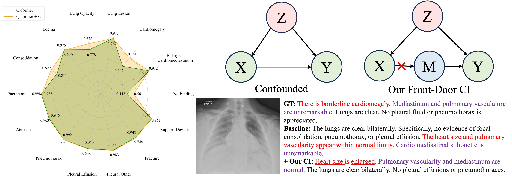

# Mitigating Co-Occurrence Bias in Medical Report Generation via Causal Intervention
This is the implementation of Mitigating Co-Occurrence Bias in Medical Report Generation via Causal Intervention.

